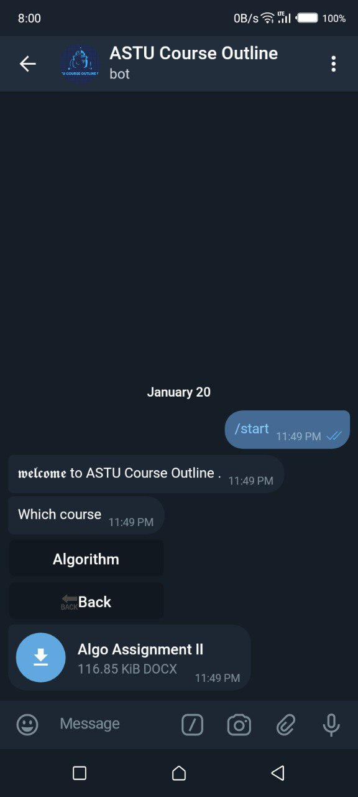

# Course Outline Telegram Bot 

This is a Python script that runs a Telegram bot to share course outlines inside specific university. 


>  


## Usage
> * `/start` to start the bot 
> * `/cancel` to cancel any operation 
> * `/add_admin` - To add admins.
> * `/list_admins` - To list admin.
> * `/remove_admin` - To remove admin
> * `/add_school` - to add school.
> * `/add_department` - to add department.
> * `/add_course` - to add course.
> * `/remove_school` - to remove school
> * `/remove_department` - to remove department
> * `/remove_course` - to remove course

### Requiremets
Inorder to user this source code you should install system requirements.
- `Python3 (>= 3.6)`
- `git`

### Procedures
First you need to clone this repository into your system using the following command.
```makedown
git clone https://github.com/milki93/astu-co-bot.git
```
Change the directory into the code
```makedown
cd astu-co-bot/
```
Install system requirements
```makedown
python -m pip install -r requirements.txt
```
Change directory to src/
```makedown
cd src/
```
Rename the .env.sample file into .env

For bash users
```markdown
mv .env.sample .env
```

For CMD users
```markdown
ren .env.sample .env
```
Edit `.env` file and insert you data
- `TOKEN` - You Telegram [bot token](https://core.telegram.org/bots#3-how-do-i-create-a-bot) 
- `SUPERADMINS` - List of superadmins separated by comma (username or Telegram user id). Eg. @milkfh,12345678
- `DATABASE_NAME` - Custom database name, default `astu-co-bot`

Save .env file and run `main.py`
```markdown
python main.py
```


### Contact 

> * &nbsp;&nbsp;[Gmail](mailto:milkidida131@gmail.com)
> * &nbsp;&nbsp;[Github](https://github.com/milki93/astu-co-bot.git)
> * &nbsp;&nbsp;[LinkedIn](https://www.linkedin.com/in/milki-dida)
> * &nbsp;&nbsp;[Telegram](https://t.me/Milkfh)
